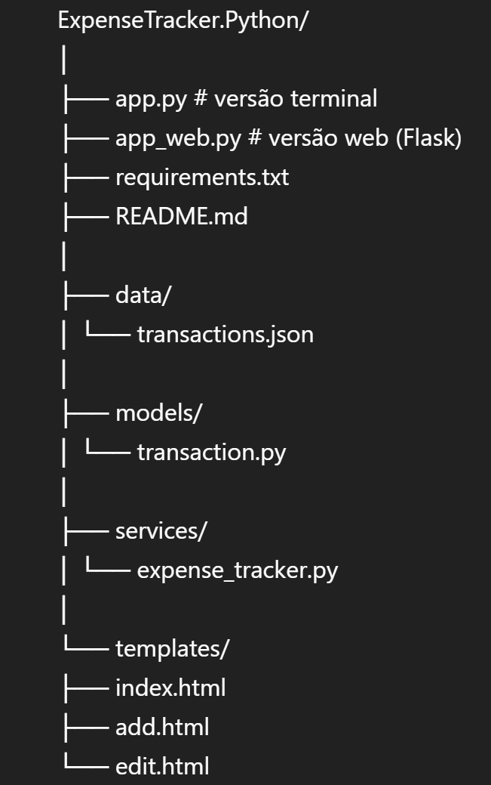
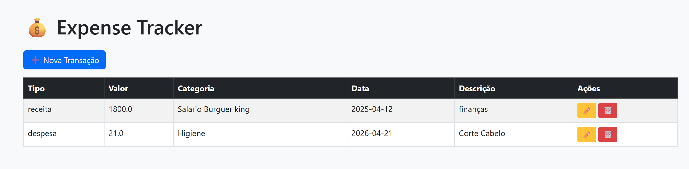
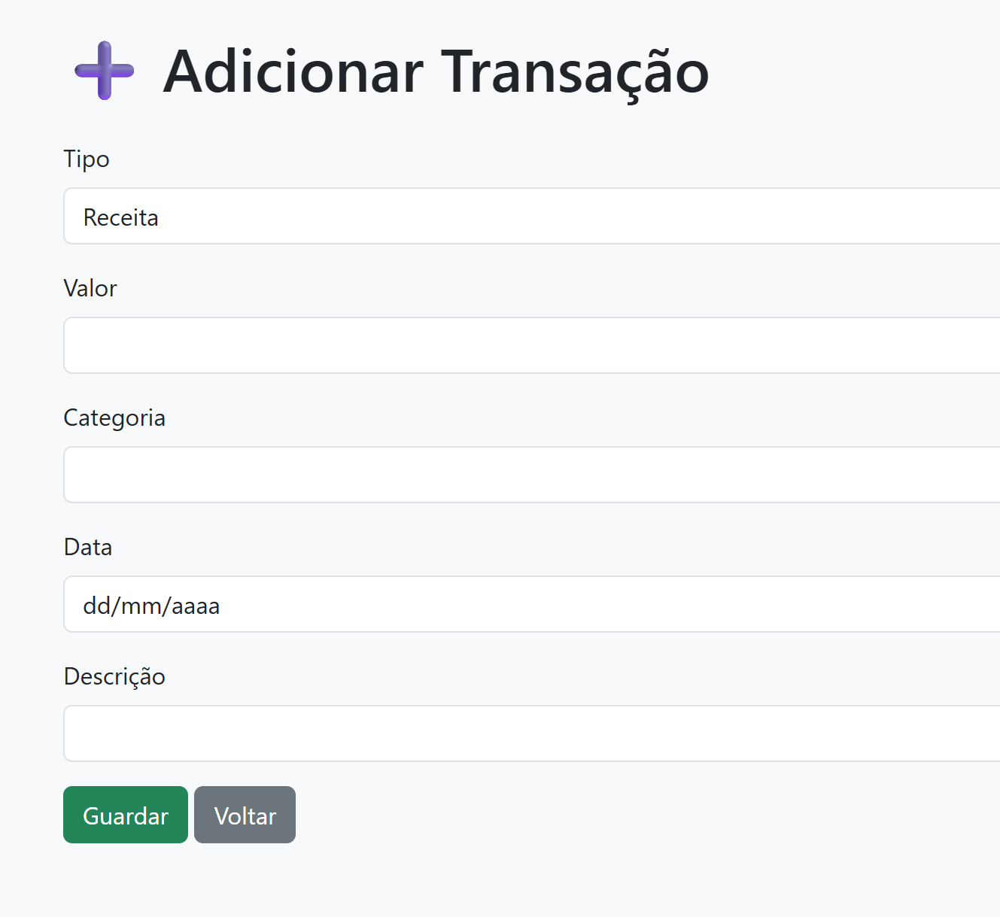
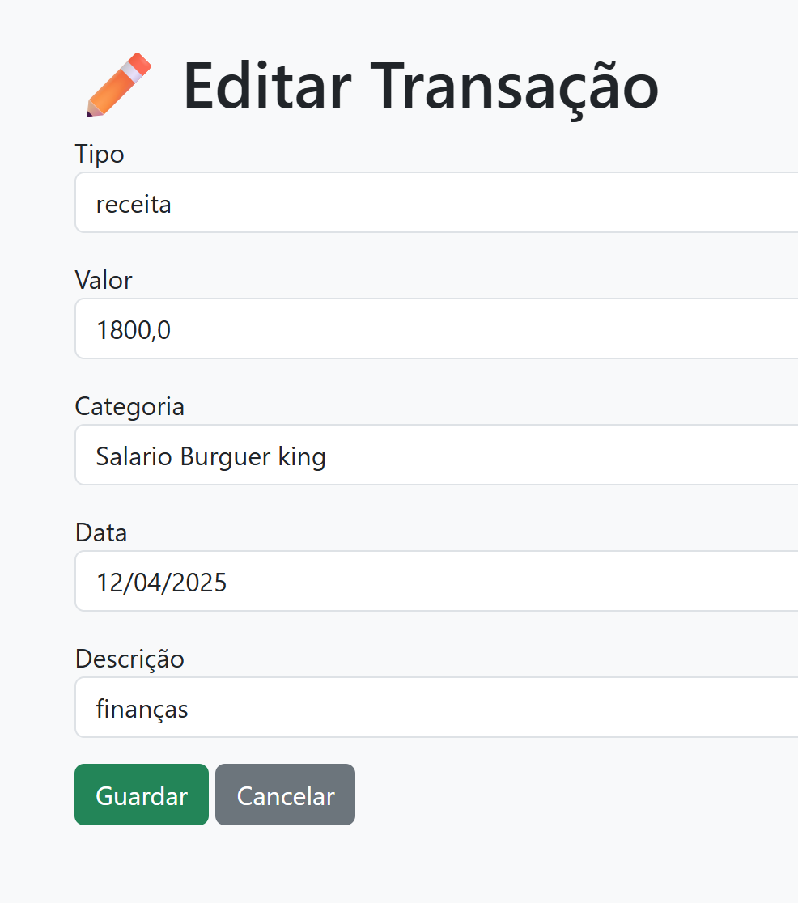

# 💰 Expense Tracker (Python + Flask)

Aplicação web para gestão de despesas pessoais desenvolvida em Python com Flask.

---

## 🚀 Funcionalidades

- ➕ Adicionar transações
- 📋 Listar transações
- ✏️ Editar transações
- 🗑️ Apagar transações
- 💾 Guardar dados em JSON
- 🌐 Interface web com Flask
- 🖥️ Versão terminal em Python

---

## 🛠️ Tecnologias Utilizadas

- Python
- Flask
- HTML
- Jinja2
- Bootstrap
- JSON
- Git/GitHub

---

## 📁 Estrutura do Projeto









---

## ▶️ Como Executar o Projeto

### 1. Instalar dependências

```bash
pip install -r requirements.txt
